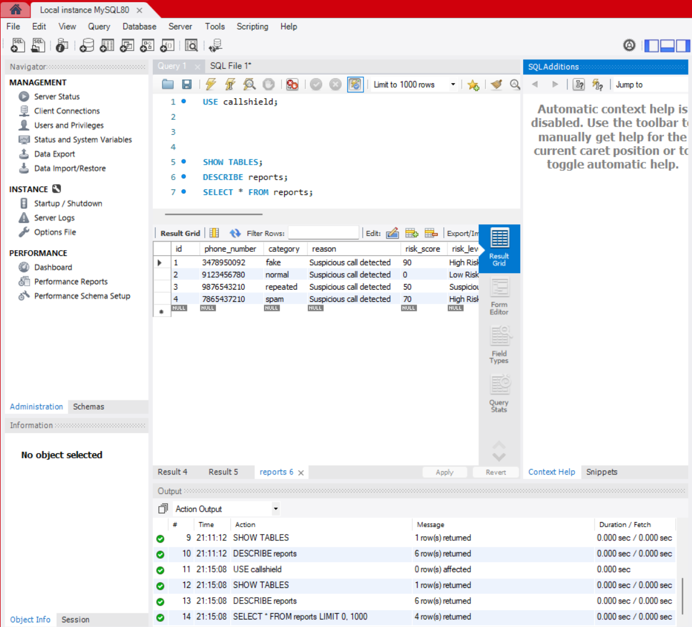
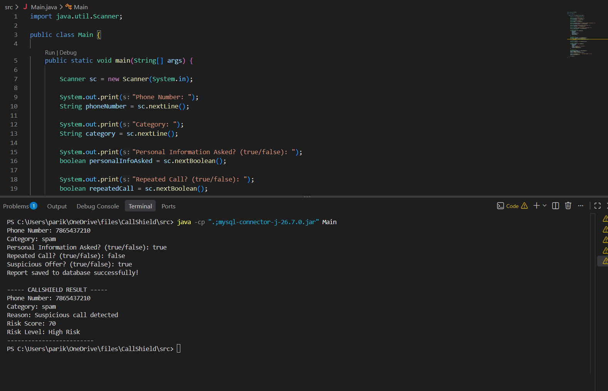

# CallShield

## Overview

CallShield is a Java-based scam call risk detection and reporting system. It is designed to help users identify potentially suspicious phone calls by analyzing basic call-related information.

The system takes details such as the phone number, call category, requests for personal information, repeated calls, and suspicious offers as input. Based on these details, CallShield calculates a risk score and classifies the call as Low Risk, Suspicious, or High Risk.

The system also generates a scam call report and stores the report in a MySQL database using JDBC.

## Features

- Enter phone number and call category
- Record important characteristics of a suspicious call
- Check whether personal information was requested
- Check whether the caller repeatedly contacted the user
- Check for suspicious offers
- Calculate a risk score
- Classify calls into Low Risk, Suspicious, or High Risk
- Generate a detailed scam call report
- Store generated reports in a MySQL database
- Connect Java with MySQL using JDBC

## Technologies / Tools Used

- **Java** – Main programming language
- **Object-Oriented Programming (OOP)** – Used for modular project design
- **JDBC** – Used for connecting Java with MySQL
- **MySQL** – Used for storing call reports
- **MySQL Workbench** – Used for database creation and management
- **Visual Studio Code** – Used for development and testing
- **GitHub** – Used for version control and project submission

## Installation and Run

### Prerequisites

Install the following before running the project:

- Java JDK
- MySQL Server
- MySQL Workbench
- MySQL Connector/J
- Visual Studio Code or any Java IDE

### Database Setup

1. Start MySQL Server.
2. Open MySQL Workbench.
3. Create the CallShield database:

```sql
CREATE DATABASE callshield;
USE callshield;
```

## Screenshots

### Database Records


### Java Project Output

